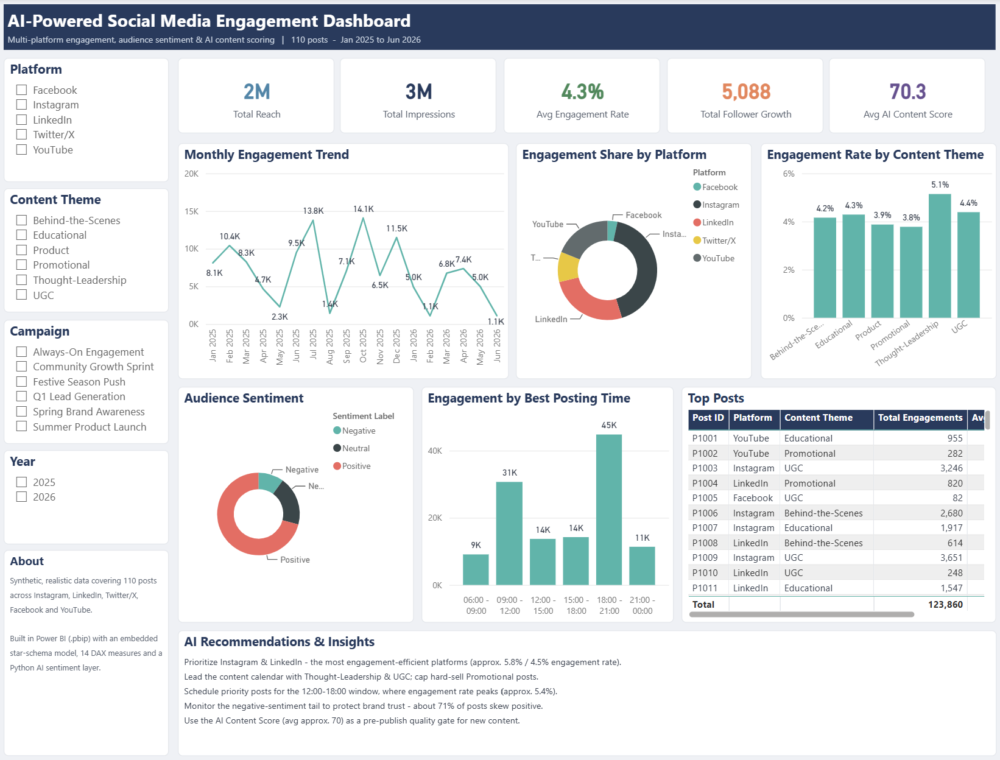

# 📊 AI-Powered Social Media Engagement Dashboard (Power BI)

An interactive, executive-ready **Power BI** dashboard that turns raw social-media
engagement data into content strategy — tracking **reach, impressions, engagement rate,
follower growth, audience sentiment, and an AI content score** across Instagram,
LinkedIn, Twitter/X, Facebook, and YouTube.

> Built as a portfolio-grade digital-marketing analytics project. The Power BI file is
> provided in the open, source-control-friendly **`.pbip`** (Power BI Project) format,
> with an **AI sentiment-analysis** layer in Python.

---

## 🎯 Objective
Design a professional dashboard that helps a brand, agency, or social-media team answer:
*Which platforms and content themes drive the most engagement? What post formats and
posting times perform best? How does audience sentiment affect performance, and how can
an AI content score guide what we publish next?*

---

## 🧩 Business Problem
Brands publish across many platforms but rarely have a single, trustworthy view of what
is actually working. Likes and follower counts are vanity metrics; **engagement rate,
sentiment, and content effectiveness** are what move the brand forward. This project
consolidates multi-platform engagement data, layers AI sentiment + content scoring on
top, and presents it as a decision-ready dashboard for content planning and campaign
optimisation.

---

## 📦 Dataset
Synthetic but realistic multi-platform social-media data — **110 posts, Jan 2025 – Jun 2026**,
across 5 platforms, 6 content themes, and 6 campaigns. The data lives in
[`data/social_media_engagement.csv`](data/social_media_engagement.csv) and is **also
embedded inside the model** (`#table()` literals), so the report opens with no external
file path to fix.

| Column | Description |
|---|---|
| Post ID | Unique post identifier |
| Platform | Instagram / LinkedIn / Twitter-X / Facebook / YouTube |
| Post Date | Publish date (ISO `yyyy-MM-dd`) |
| Post Type | Reel / Carousel / Image / Story / Video / Short / Text |
| Content Theme | Educational / Promotional / Behind-the-Scenes / UGC / Product / Thought-Leadership |
| Caption | Post copy |
| Hashtags Used | Hashtags attached to the post |
| Impressions | Times the post was served |
| Reach | Unique accounts reached (≤ Impressions) |
| Likes / Comments / Shares / Saves | Engagement actions |
| Profile Visits | Profile visits driven by the post |
| Link Clicks | Outbound link clicks |
| Engagement Rate % | `(Likes+Comments+Shares+Saves) / Impressions` |
| Follower Growth | Net followers gained from the post |
| Sentiment Score | AI polarity of audience response, −1.0 … +1.0 |
| AI Content Score | AI-assessed content effectiveness, 0–100 |
| Best Posting Time | Time-of-day band the post went live |
| Campaign Name | Marketing campaign the post belongs to |

A derived **Sentiment Label** (Positive / Neutral / Negative) is computed in Power Query
from `Sentiment Score`.

---

## 🤖 AI Analysis Logic
- **Sentiment analysis** — audience comments/captions are scored for polarity
  (−1.0 … +1.0) and bucketed into **Positive / Neutral / Negative**. The reference
  implementation is in [`scripts/sentiment_analysis.py`](scripts/sentiment_analysis.py)
  (TextBlob, with an optional Claude LLM hook for production-grade nuance). The same
  thresholds (>0.10 Positive, <−0.10 Negative) are mirrored in the model's
  `Sentiment Label` column.
- **AI content scoring** — each post carries an **AI Content Score (0–100)** that blends
  engagement strength with audience sentiment, giving a single, comparable signal of how
  effective the content is — useful for ranking ideas before and after publishing.

---

## 📐 Engagement KPI Framework (DAX measures)
`Total Impressions` · `Total Reach` · `Total Engagements` · `Total Posts` ·
`Total Follower Growth` · `Total Link Clicks` · `Total Profile Visits` ·
`Avg Engagement Rate` (= Engagements ÷ Impressions) · `CTR %` (= Link Clicks ÷ Impressions) ·
`Avg AI Content Score` · `Avg Sentiment Score` · `Positive Sentiment %` ·
`Engagement Prev Month` (DATEADD) · `Engagement MoM Growth %`.

---

## 🧱 Methodology
1. **Data collection & structuring** — a 21-field schema covering every post, platform, and engagement signal.
2. **Data cleaning & transformation (Power Query / M)** — typed every column, parsed dates safely (ISO), derived `Sentiment Label`.
3. **AI layer** — sentiment scoring + AI content scoring on the post text.
4. **Data modelling** — a star schema: an **Engagement** fact table related to a dedicated **DateTable** (built with `List.Dates`) on `Post Date → Date`, enabling time-intelligence.
5. **DAX measures** — the KPI framework above.
6. **Visualisation** — a single-page, consolidated, executive-friendly dashboard.
7. **Insight generation** — translated visuals into content recommendations.

---

## 📊 Dashboard



A single, recruiter-ready canvas (1280×980) laid out the way an analyst would present to
leadership — header banner, left filter rail, KPI band, and grouped insight sections:

- **Header banner** — dashboard title + dataset context.
- **Filter rail (left):** slicers for **Platform, Content Theme, Campaign, and Year**, plus an "About" note — all visuals cross-filter together.
- **KPI band (top):** five cards — **Total Reach, Total Impressions, Avg Engagement Rate, Follower Growth, AI Content Score.**
- **Performance section (middle):** **Monthly Engagement Trend** (line), **Engagement Share by Platform** (donut), and **Engagement Rate by Content Theme** (column).
- **Sentiment & content section (bottom):** **Audience Sentiment** (donut), **Engagement by Best Posting Time** (column), and a **Top Posts** table.
- **AI Recommendations panel:** a written takeaways box translating the visuals into next actions.

Styling is institutional-grade: consistent navy/teal palette, white cards with subtle rounded
borders on a light canvas, titled visuals, data labels, and positioned legends.

---

## 💡 Key Insights (from the sample data)
- **~2.9M impressions and ~2.1M reach across 110 posts**, generating **~124K engagements** at a **4.3% average engagement rate** and **+5,088 followers**.
- **Instagram is the engagement leader (~5.8% ER)**, followed by **LinkedIn (~4.5%)**; **Facebook (~2.5%)** and **Twitter/X (~2.8%)** lag — a case for shifting effort toward Reels/Carousels.
- **Thought-Leadership (~5.1% ER) and UGC (~4.4%) outperform Promotional content (~3.8%)** — audiences reward insight and authenticity over hard selling.
- **Afternoon posting wins:** the **15:00–18:00 (~5.4%)** and **12:00–15:00 (~5.1%)** bands beat the late-morning slot — a clear scheduling lever.
- **Audience sentiment skews positive (~71% of posts)**, but a tracked Negative tail flags content/comments worth a closer look.
- **AI Content Score (~70 avg)** correlates with engagement and gives a single pre-publish quality signal for ranking content ideas.

---

## ✅ Recommendations
- **Double down on Instagram + LinkedIn** for reach-efficient engagement; treat Facebook as repurposing, not origination.
- **Lead the content calendar with Thought-Leadership and UGC**; cap Promotional posts and pair them with value-first hooks.
- **Schedule priority posts for the 12:00–18:00 window.**
- **Watch the negative-sentiment tail** — review those posts/comments to protect brand trust.
- **Use the AI Content Score as a pre-publish gate** — iterate on captions/creative until the score clears a chosen threshold.

---

## 🚀 How to open the `.pbip`
1. Install **Power BI Desktop** (March 2026 build or later recommended).
2. Open [`dashboard/AI-Powered Social Media Engagement Dashboard.pbip`](dashboard/).
3. The data is **embedded** in the model (`#table()` literals), so it loads with **no external file path** to fix.
4. The bundled CSV in `data/` is the same data, kept for transparency and easy editing.

> Built text-first (no manual authoring in Desktop) following
> [`docs/PBIP_Build_Playbook.md`](docs/PBIP_Build_Playbook.md), then validated offline before opening.

---

## 🗂️ Repository Structure
```
AI-Powered Social Media Engagement Dashboard/
├─ README.md
├─ AI-Powered Social Media Engagement Dashboard.docx   # project brief
├─ Project Descriptions (Resume + ATS).docx            # resume / ATS-ready descriptions
├─ data/
│  └─ social_media_engagement.csv                      # 110 posts × 21 fields
├─ dashboard/                                          # Power BI .pbip (model + report)
│  ├─ *.SemanticModel/   (model.bim, …)
│  └─ *.Report/          (report.json, theme, …)
├─ docs/
│  ├─ PBIP_Build_Playbook.md
│  ├─ dashboard_image_prompt.md
│  └─ screenshots/
├─ scripts/
│  └─ sentiment_analysis.py                            # AI sentiment layer
└─ Linkedin Post/
   └─ linkedin_post.docx
```

---

## 🧰 Tech Stack
**Power BI** (`.pbip`, Power Query / M, DAX, star schema, time-intelligence) ·
**Python** (TextBlob / Claude for sentiment) · **CSV** data.

---

## 🧾 Conclusion
This project demonstrates an end-to-end digital-marketing analytics workflow: from a
structured multi-platform dataset and an AI sentiment/content-scoring layer, through a
clean star-schema data model and DAX KPI framework, to a recruiter-ready, decision-driving
Power BI dashboard. It shows not just *what* engagement happened, but *which content,
platforms, and timing to invest in next.*
